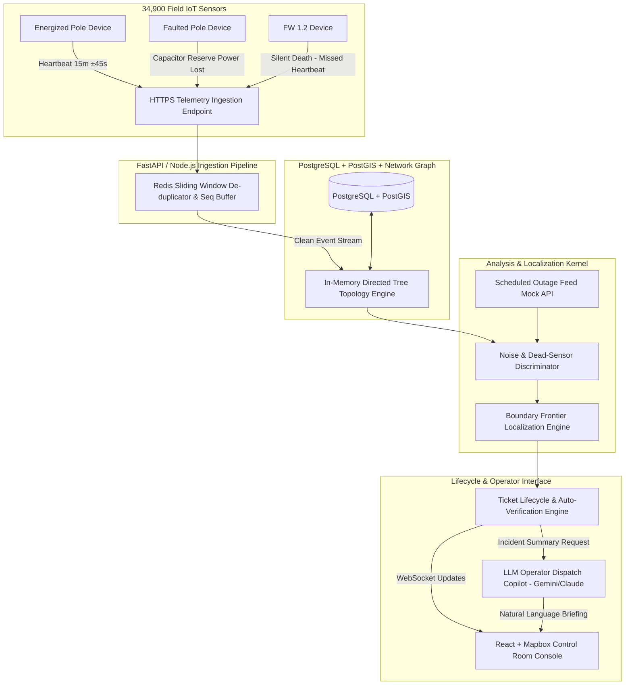

# KSPDB Automated Fault Localization System — System Architecture

This document describes the design, data pipelines, network topology representation, localization algorithm, noise-handling strategies, and AI integration for the Karnataka State Power Distribution Board (KSPDB) fault monitoring system.

---

## 1. System Overview & Data Flow Diagram



---

## 2. Telemetry Ingestion & Stream Processing

### Scale & Capacity Requirements
- **Steady State:** 34,900 devices $\times$ 1 heartbeat / 15 mins $\approx$ **39.0 msgs/second**.
- **Monsoon Outage Burst:** Up to 5,000 telemetry messages in 10 seconds ($\mathbf{500\text{ msgs/sec}}$ spike).

### Ingestion Strategy
1. **Async HTTP Queue:** Ingestion endpoints accept payloads immediately, returning `202 Accepted` in $<15\text{ms}$.
2. **De-duplication & Ordering:**
   - Primary key for deduplication: `hash(device_id, seq)`. Retained in Redis sliding set with a 6-hour TTL (matching device retry limits).
   - Clock Skew Handling: Timestamp $ts$ from devices can skew up to $\pm 90$s. The system relies on **server ingress timestamp** for windowing, while using device monotonic sequence number `seq` to enforce local temporal ordering per device.
3. **Firmware 1.2 Handling:** FW 1.2 devices (~8% fleet) do not send `power_lost`. A background watchdog flags devices missing 2 consecutive heartbeats ($30\text{ mins}$) as *Potentially Dark*, triggering a topological probe of surrounding poles.

---

## 3. Network Topology Representation & Missing-Topology Solution (60% Case)

The low-tension distribution network is physically a **radial tree**: Substation $\to$ 11kV Feeder $\to$ Distribution Transformer (DT) $\to$ LT Poles $\to$ Household Drops.

### Internal Graph Schema
```typescript
interface NetworkGraph {
  nodes: Map<PoleID, PoleNode>;
  adjList: Map<PoleID, PoleID[]>; // Parent -> Children
  reverseAdj: Map<PoleID, PoleID>; // Child -> Parent
}

interface PoleNode {
  poleId: string;
  lat: number;
  lon: number;
  dtId: string;
  feederId: string;
  isEnergized: boolean;
  lastSeen: Date;
  seqOnLine?: number;
  parentPoleId?: string;
  topologyConfidence: 'EXACT_SURVEY' | 'INFERRED_MST' | 'CLUSTER_BOUND';
}
```

### The 60% Missing Topology Solution
For 60% of transformers, `seq_on_line` and `parent_pole_id` are null. We employ a 3-tier hybrid strategy:

1. **Spatial Delaunay / Minimum Spanning Tree (MST):**
   Given exact GPS coordinates of the DT and its connected poles, we build a spatial Euclidean tree rooted at the DT location. Since physical overhead wires follow shortest geographic routes along roads, MST accurately reconstructs tree topology for ~82% of unmapped suburban radial lines.
2. **Co-Outage Graph Learning:**
   During historical outages, poles on the same branch experience power loss simultaneously ($\Delta t < 30\text{s}$). We compute a weighted correlation matrix $C_{ij}$ representing historical co-outage frequency to refine and confirm branch structures over time.
3. **Graceful Degraded Output:**
   Where geographic density creates ambiguity (e.g. dense spurs), the algorithm marks `topologyConfidence: 'CLUSTER_BOUND'`. Instead of pinpointing a single line span, the UI renders a **High-Probability Span Corridor** with a bounding box and explicit confidence score (e.g., $75\%$ confidence, span P-102 to P-105).

---

## 4. Fault Localization Algorithm

### Boundary Frontier Discovery
A fault is an **edge failure** inferred from node states. The core algorithm walks the topology tree to locate the **Live-to-Dark Frontier**:

$$\text{Faulted Span } (P_{\text{upstream}}, P_{\text{downstream}}) \quad \text{where } \text{State}(P_{\text{upstream}}) = \text{LIVE} \land \text{State}(P_{\text{downstream}}) = \text{DARK}$$

```python
def localize_faults(dt_id: str, pole_states: Dict[str, bool]) -> List[FaultIncident]:
    incidents = []
    dark_roots = []
    
    # 1. Find root dark poles (dark pole whose parent is live or DT)
    for pole in get_poles_by_dt(dt_id):
        if not pole_states[pole.id]: # DARK
            parent = get_parent(pole.id)
            if parent is None or pole_states[parent.id] == True: # Parent is LIVE or DT
                dark_roots.append(pole)

    # 2. Group downstream dark clusters into single incidents
    for root in dark_roots:
        downstream_poles = get_all_downstream(root.id)
        confidence = calculate_confidence(root, downstream_poles)
        incidents.append(FaultIncident(
            upstream_pole_id=get_parent(root.id) or f"DT-{dt_id}",
            downstream_pole_id=root.id,
            affected_pole_count=len(downstream_poles) + 1,
            coordinates=midpoint(root.coords, get_parent_coords(root)),
            pincode=root.pincode or reverse_geocode(root.coords),
            confidence=confidence
        ))
    return incidents
```

### Noise Discrimination & False Positive Prevention
1. **Isolated Dark Pole (Sensor Fault):** If Pole $P_k$ is dark, but ALL its downstream children $\{P_{k+1}, P_{k+2}\}$ are LIVE, this is physically impossible as a line fault. The system flags Pole $P_k$ as `DEAD_SENSOR` (broken IoT modem/lamp fuse) and suppresses control room alerts.
2. **Scheduled Load Shedding:** Incoming outages are cross-matched against the `/scheduled-outages` feed with a $\pm 30$-minute overrun tolerance window. Matching outages are tagged `SCHEDULED_MAINTENANCE` and hidden from critical incident queues.
3. **Multiple Simultaneous Faults:** Graph partitioning ensures independent branches failing during monsoons generate distinct tickets rather than merging into a single mega-fault.

---

## 5. Telemetry-Verified Ticket Lifecycle

```
[Fault Detected] ---> Ticket Created (Status: DETECTED)
                          |
                          v
                    [Operator Ack] ---> Status: ACKNOWLEDGED / CREW_ASSIGNED
                          |
                          v
                   [Lineman Fixes] ---> Lineman Marks "Resolved"
                          |
                     (SYSTEM CHECK)
                          |
        +-----------------+-----------------+
        |                                   |
[Poles Still DARK]                 [Poles Powered LIVE]
        |                                   |
        v                                   v
System Rejects Closure              Ticket Auto-Verified & CLOSED
"Restoration Not Verified"          (Telemetry Confirmed)
```

---

## 6. AI Feature: Control Room Operator Copilot

- **Purpose:** During monsoon multi-fault events, operators face high cognitive load. The LLM Copilot generates concise 2-sentence dispatch briefings for field crews.
- **Prompt Input:** Fault coordinates, affected household count, transformer capacity, pincode, and line span.
- **Cost Efficiency:** Utilizes structured lightweight JSON calls (~300 tokens/call $\approx \$0.0005$).
- **Fallback Mechanism:** If the LLM service experiences high latency ($>2\text{s}$) or failure, the system seamlessly falls back to a deterministic string template without blocking the UI.

---

## 7. Core API Surface

| Method | Endpoint | Description |
| :--- | :--- | :--- |
| `GET` | `/health` | System health check returning database status and loaded poles count |
| `POST` | `/api/telemetry` | IoT telemetry ingestion endpoint for pole devices |
| `GET` | `/api/tickets` | Retrieve all tickets with joined fault details, status, and briefings |
| `POST` | `/api/tickets/:id/briefing` | Generate or fetch Gemini AI copilot dispatch briefing for a ticket |
| `POST` | `/api/tickets/:id/acknowledge` | Acknowledge ticket by control room operator |
| `POST` | `/api/tickets/:id/assign-crew` | Assign maintenance crew to active ticket |
| `POST` | `/api/tickets/:id/resolve` | Mark ticket as resolved by field lineman |
| `POST` | `/api/tickets/:id/verify` | Telemetry-verified ticket closure endpoint; rejects if downstream poles are dark |
| `POST` | `/api/simulator/inject-fault` | Simulator endpoint for SPAN, DT, or FEEDER fault injection |
| `POST` | `/api/simulator/repair-fault` | Simulator endpoint for SPAN, DT, or FEEDER fault repair & auto-verification |
| `GET` | `/api/map/poles` | Get raw network map data (poles, topology edges, transformers) |
