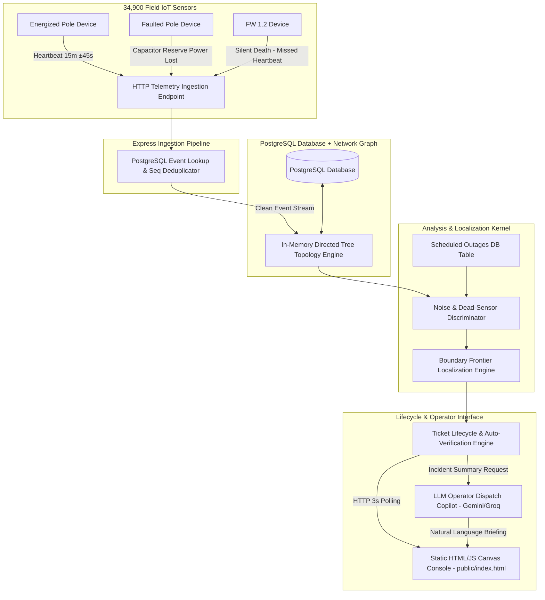

# KSPDB Automated Fault Localization System — System Architecture

This document describes the design, data pipelines, network topology representation, localization algorithm, noise-handling strategies, and AI integration for the Karnataka State Power Distribution Board (KSPDB) fault monitoring system.

---

## 1. System Overview & Data Flow Diagram



---

## 2. Telemetry Ingestion & Stream Processing

### Scale & Capacity Requirements
- **Steady State:** 34,900 devices $\times$ 1 heartbeat / 15 mins $\approx$ **39.0 msgs/second**.
- **Monsoon Outage Burst:** Up to 5,000 telemetry messages in 10 seconds ($\mathbf{500\text{ msgs/sec}}$ spike).

### Ingestion Strategy
1. **Async HTTP Ingestion:** Ingestion endpoint `POST /api/telemetry` accepts payloads immediately, returning `202 Accepted` in $<15\text{ms}$.
2. **De-duplication & Ordering in PostgreSQL:**
   - Primary key for deduplication: lookup on `(device_id, seq)` in `telemetry_events` table via `SELECT id FROM telemetry_events WHERE device_id = $1 AND seq = $2`. If existing record is found, event returns `duplicate_ignored` with `reLocalized: false`.
   - Sequence Ordering Check: Sequence order is enforced by checking `SELECT MAX(seq) as max_seq FROM telemetry_events WHERE device_id = $1`. Only if `payload.seq >= max_seq` does the system update the pole's `is_energized` status in PostgreSQL.
3. **State Sync & Re-Localization Trigger:** When `is_energized` state changes, `syncFaultsAndTicketsForDt(dtId)` is executed for the affected transformer, updating active tickets and closing resolved tickets automatically.

---

## 3. Network Topology Representation & Missing-Topology Solution (60% Case)

The low-tension distribution network is physically a **radial tree**: Substation $\to$ 11kV Feeder $\to$ Distribution Transformer (DT) $\to$ LT Poles $\to$ Household Drops.

### Internal Graph Schema
```typescript
interface TopologyEdge {
  dt_id: string;
  parent_pole_id: string; // DT id or pole_id
  child_pole_id: string;
  distance_meters: number;
  source: 'explicit' | 'inferred';
  confidence: number;
}
```

### The 60% Missing Topology Solution
For 60% of transformers, `seq_on_line` and `parent_pole_id` are null.

Instead of manual surveys, `topologyBuilder.ts` employs a **greedy nearest-neighbor tree construction algorithm** grown outward from the Distribution Transformer (DT) coordinates:

1. **Root Connection:** The DT geographic coordinates `(lat, lon)` serve as the initial root of the connected tree node map `connectedNodes`.
2. **Greedy Frontier Expansion:** At each step, the algorithm computes the Haversine distance between every already-connected node and every unconnected pole under the transformer, selecting the shortest geographic edge `bestDist`.
3. **Proximity Confidence Decay:** Edge confidence decays with longer inter-pole distance according to the exact code formula:
   ```typescript
   const confidence = Math.max(0.40, Math.min(0.90, Math.round((1.0 - (bestDist / 250.0)) * 100) / 100));
   ```
4. **Edge Classification:** Edges built using recorded survey data receive `source: 'explicit'` with `confidence: 1.0`. Edges constructed via nearest-neighbor inference receive `source: 'inferred'` with distance-decayed confidence (`0.40` to `0.90`).

---

## 4. Fault Localization Algorithm

### Plain-English Walkthrough of `localizeFaults()` in `localization.ts`

The core localization engine in `src/services/localization.ts` evaluates pole telemetry states against network topology trees through a 4-step sequence:

1. **Active Scheduled Outage Filtering:**
   Cross-references incoming outages with active entries in `scheduled_outages` where `start_time <= now <= end_time`. Outages matching a target feeder or transformer DT are added to suppression sets `activeScheduledFeeders` and `activeScheduledDts`, suppressing downstream incident tickets.

2. **Feeder-level Outage Detection:**
   Checks all poles under each feeder. If every pole under a feeder is un-energized and not covered by a scheduled outage, a single `FEEDER` blackout ticket is created at confidence `1.0`.

3. **DT-level Outage Detection:**
   Checks all poles under each Distribution Transformer. If every pole under a DT is un-energized (and not covered by feeder outage or scheduled outage), a single `DT` transformer outage ticket is created.

4. **Dead-Sensor Discrimination (`hasEnergizedDescendants`):**
   Scans un-energized poles. If a dark pole has at least one energized downstream child in its subtree (computed recursively via `hasEnergizedDescendants(nodeId)`), it is flagged as a `DEAD_SENSOR` (broken IoT modem/lamp fuse) rather than a line fault.

5. **Live/Dark Boundary Frontier Walk:**
   Iterates through topology edges to identify **frontier boundary edges** `(parent, child)` where `isNodeLive(parent) == true` and `isNodeLive(child) == false`. For each frontier root:
   - Computes the geographical midpoint `(lat, lon)` between parent and child node.
   - Recursively traverses all downstream children under the dark root to count total affected poles.
   - Creates a localized `SPAN` fault incident tagged with exact coordinates, PIN code, and topology confidence.

### Noise Discrimination & False Positive Prevention
1. **Isolated Dark Pole (Sensor Fault):** Flagged via `hasEnergizedDescendants()` and suppressed from creating line break tickets.
2. **Scheduled Load Shedding:** Checked against `scheduled_outages` table to suppress false alarms during planned maintenance.
3. **Multiple Simultaneous Faults:** Graph boundary traversal isolates independent line breaks across separate branches into distinct tickets.

---

## 5. Telemetry-Verified Ticket Lifecycle

```
[Fault Detected] ---> Ticket Created (Status: DETECTED)
                          |
                          v
                    [Operator Ack] ---> Status: ACKNOWLEDGED / CREW_ASSIGNED
                          |
                          v
                   [Lineman Fixes] ---> Lineman Marks "Resolved"
                          |
                     (SYSTEM CHECK)
                          |
        +-----------------+-----------------+
        |                                   |
[Poles Still DARK]                 [Poles Powered LIVE]
        |                                   |
        v                                   v
System Rejects Closure              Ticket Auto-Verified & CLOSED
"Restoration Not Verified"          (Telemetry Confirmed)
```

---

## 6. AI Feature: Control Room Operator Copilot

- **Purpose:** During monsoon multi-fault events, operators face high cognitive load. The LLM Copilot generates concise 2-sentence dispatch briefings for field crews.
- **Prompt Input:** Fault coordinates, affected household count, transformer capacity, pincode, and line span.
- **Cost Efficiency:** Utilizes structured lightweight JSON calls (~300 tokens/call $\approx \$0.0005$).
- **Fallback Mechanism:** If the LLM service experiences high latency ($>2\text{s}$) or failure, the system seamlessly falls back to a deterministic string template without blocking the UI.

---

## 7. Core API Surface

| Method | Endpoint | Description |
| :--- | :--- | :--- |
| `GET` | `/health` | System health check returning database status and loaded poles count |
| `POST` | `/api/telemetry` | IoT telemetry ingestion endpoint for pole devices |
| `GET` | `/api/tickets` | Retrieve all tickets with joined fault details, status, and briefings |
| `POST` | `/api/tickets/:id/briefing` | Generate or fetch Gemini AI copilot dispatch briefing for a ticket |
| `POST` | `/api/tickets/:id/acknowledge` | Acknowledge ticket by control room operator |
| `POST` | `/api/tickets/:id/assign-crew` | Assign maintenance crew to active ticket |
| `POST` | `/api/tickets/:id/resolve` | Mark ticket as resolved by field lineman |
| `POST` | `/api/tickets/:id/verify` | Telemetry-verified ticket closure endpoint; rejects if downstream poles are dark |
| `POST` | `/api/simulator/inject-fault` | Simulator endpoint for SPAN, DT, or FEEDER fault injection |
| `POST` | `/api/simulator/repair-fault` | Simulator endpoint for SPAN, DT, or FEEDER fault repair & auto-verification |
| `GET` | `/api/map/poles` | Get raw network map data (poles, topology edges, transformers) |
